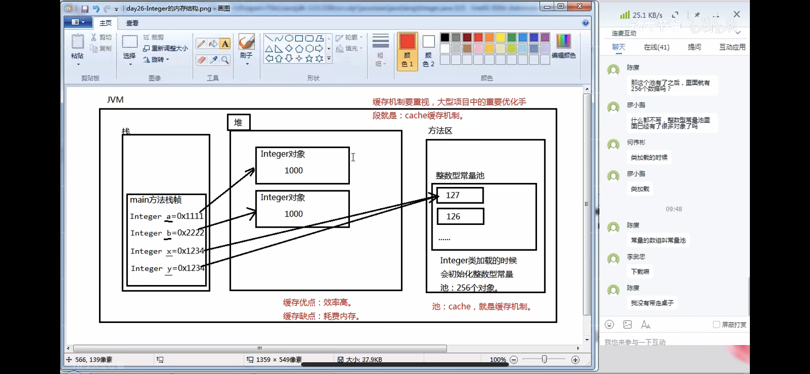
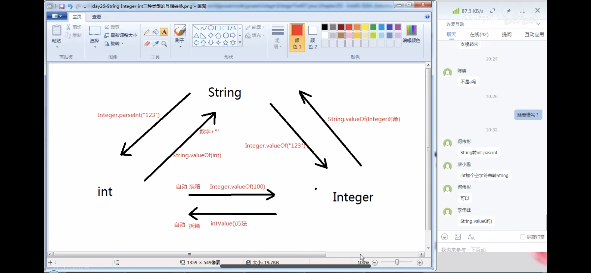

# 1--String类
## 1.1 对Stirng在内存存储方面的理解
- 字符串一旦创建不可变
- 双引号括起来的字符串存储在字符串常量池中
- 字符串的比较必须使用equals方法
- String已经重写了toString( )和equals( )方法

## 1.2 String的构造方法  

- String s = ""; (保存的是对象的内存地址)
- String s = new String(" ");
- String s = new String(byte数组);
- String s = new String(byte数组 ,起始下标 ,长度); 
- String s = new String(char数组);
- String s = new String(char数组 ,起始下标 ,长度);

# 2--StringBuffer/StringBuilder

## 2.1 StringBuffer/StringBuilder可以看作可变长度字符串  
## 2.2 StringBuffer/StringBuilder初始化容量16
## 2.3 StringBuffer/StringBuilder是完成字符串拼接操作的，方法名：append
## 2.4 StringBuffer是线程安全的  StringBuilder是非线程安全的
## 2.5 频繁进行字符串拼接不建议使用“ + ”  

# 3--八种基本数据类型对应的包装类

## 3.1 包装类存在的作用？  
 - 方便编程

## 3.2 八种包装类的类名是什么？
- Byte
- Short
- Integer
- Long
- Float
- Double
- Boolean
- Character

## 3.3 所有数字的父类 Number
## 3.4 什么是装箱？什么是拆箱？
  Integer x = 100;  //x里面并不是保存100，保存的是100这个对象的内存地址

  Integer y = 100;  

  System.out.println(x  == y);   //true
  
  Integer x = 128;  

  Integer y = 128;  

  System.out.println(x  == y);   //false

 

## 3.5 Integer类常用方法
  Integer.ValueOf();
  Integer.parseInt("123");
  Integer.parseInt("中文");  //NumberFormatException

## 3.6 Integer String int 三种类型互相转换 

# 4--日期类
## 4.1 获取系统当前时间
Date d = new Date( );

## 4.2 日期格式化 Date --> String
  yyyy--MM--dd HH:mm:ss SSS
  SimpleDateFormat sdf = new SimpleDate("yyyy--MM--dd HH:mm:ss");
  String s = sdf.format(new Date());

## 4.3 String --> Date
  SimpleDateFormat sdf = new SimpleDate("yyyy--MM--dd HH:mm:ss");  
  Date d = sdf.parse("2008-08-08 08:08:08");

## 4.4 获取毫秒数
  long begin = System.currentTimeMillis();

# 5--数字类
## 5.1 DecimalFormat数字格式化
  ###,###.## 表示加入千分位，保留两个小数  

  ###,###.0000 表示加入千分位，保留4个小数，不够补0

## 5.2 BigDecimal
  财务软件中经常使用

# 6--随机数
## 6.1 怎么产生int类型随机数
  Random r = new Random();  

  int i = r.nextInt();
## 6.2 怎么产生某个范围之内的int类型随机数
  Random r = new Random();  

  int i = r.nextInt(101); //产生[0-101]的随机数

# 7--枚举
## 7.1 枚举是一种引用数据类型
## 7.2 枚举编译之后也是class文件
## 7.3 枚举类型怎么定义？  
   enum 枚举类型名{  

      枚举值,枚举值2,枚举值3
   }

## 7.4 当一个方法执行结果超过两种情况，并且是一枚一枚可以列举出来的时候，建议返回值类型设计为枚举类型

# 8--异常处理机制
## 8.1 java中异常的作用是：增强程序健壮性
## 8.2 java中异常以类和对象的形式存在
